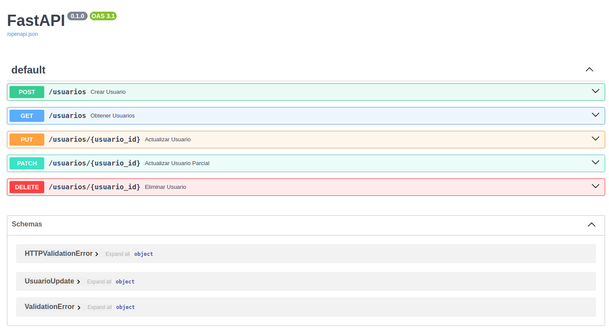

# Sample CRUD with FastAPI using sqlalchemy

This project demonstrates a simple CRUD (Create, Read, Update, Delete) application using FastAPI and sqlalchemy

## Methods

### Create
The `POST /usuarios/` endpoint allows you to create a new item. You need to provide the item details in the request body.

### Read
The `GET /usuarios/{usuario_id}` endpoint allows you to retrieve an item by its ID.

### Update
The `PUT /usuarios/{usuario_id}` endpoint allows you to update an existing item. You need to provide the updated item details in the request body.

### Delete
The `DELETE /usuarios/{usuario_id}` endpoint allows you to delete an item by its ID.

## Setting Up the Environment

1. **Clone the repository:**
    ```bash
    git clone https://github.com/wzorroman/fastapi_crud02.git
    cd fastapi_crud02
    ```

2. **Create a virtual environment:**
    ```bash
    python -m venv venv
    ```

3. **Activate the virtual environment:**
    - On Windows:
      ```bash
      venv\Scripts\activate
      ```
    - On macOS/Linux:
      ```bash
      source venv/bin/activate
      ```

4. **Install the requirements:**
    ```bash
    pip install -r requirements.txt
    ```

## Running the Project

To run the project, use the following command:
```bash
python api_template.py
```

This will start the FastAPI server, and you can access the API documentation at `http://127.0.0.1:8000/docs`.


